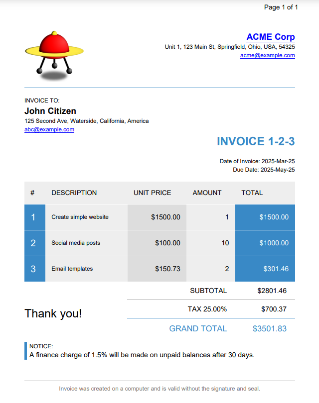

[](https://github.com/danfickle/openhtmltopdf/actions?query=workflow%3Abuild)

# OPEN HTML TO PDF



## OVERVIEW
Open HTML to PDF is a pure-Java library for rendering a reasonable subset of well-formed XML/XHTML (and even some HTML5)
using CSS 2.1 (and later standards) for layout and formatting, outputting to PDF or images.

Use this library to generated nice looking PDF documents. But be aware that you can not throw modern HTML5+ at
this engine and expect a great result. You must special craft the HTML document for this library and 
use it's extended CSS feature like [#31](https://github.com/danfickle/openhtmltopdf/pull/31) or
[#32](https://github.com/danfickle/openhtmltopdf/pull/32) 
to get good results. Avoid floats near page breaks and use table layouts.

## GETTING STARTED
+ [Integration guide](https://github.com/danfickle/openhtmltopdf/wiki/Integration-Guide) - get maven artifacts and code to get started.
+ [1.0.10 Online Sandbox](https://sandbox.openhtmltopdf.com/) - Now with logs!
+ [Templates for Openhtmltopdf](https://danfickle.github.io/pdf-templates/index.html) - MIT licensed templates that work with this project. Updated 2021-09-21.
+ [Showcase Document - PDF](https://openhtmltopdf.com/showcase.pdf)
+ [Documentation wiki](https://github.com/danfickle/openhtmltopdf/wiki)
+ [Template Author Guide - PDF - DEPRECATED - Prefer wiki](https://openhtmltopdf.com/template-guide.pdf) - Moving info to wiki
+ [Sample Project - Pretty Resume Generator](https://github.com/danfickle/pretty-resume)

## DIFFERENCES WITH FLYING SAUCER
+ Uses the well-maintained and open-source (LGPL compatible) PDFBOX as PDF library, rather than iText.
+ Proper support for generating accessible PDFs (Section 508, PDF/UA, WCAG 2.0).
+ Proper support for generating PDF/A standards compliant PDFs.
+ New, faster renderer means this project can be several times faster for very large documents.
+ Better support for CSS3 transforms.
+ Automatic visual regression testing of PDFs, with many end-to-end tests.
+ Ability to insert pages for cut-off content.
+ Built-in plugins for SVG and MathML.
+ Font fallback support.
+ Limited support for RTL and bi-directional documents.
+ On the negative side, no support for OpenType fonts.
+ Footnote support.
+ Much more. See changelog below.

## LICENSE
Open HTML to PDF is distributed under the LGPL.  Open HTML to PDF itself is licensed 
under the GNU Lesser General Public License, version 2.1 or later, available at
http://www.gnu.org/copyleft/lesser.html. You can use Open HTML to PDF in any
way and for any purpose you want as long as you respect the terms of the 
license. A copy of the LGPL license is included as license-lgpl-2.1.txt or license-lgpl-3.txt
in our distributions and in our source tree.

An exception to this is the pdf-a testing module, which is licensed under the GPL. This module is not distributed to Maven Central
and is for testing only.

Open HTML to PDF uses a couple of FOSS packages to get the job done. A list
of these can be found in the [dependency graph](https://github.com/danfickle/openhtmltopdf/network/dependencies).

## CREDITS
Open HTML to PDF is based on [Flying-saucer](https://github.com/flyingsaucerproject/flyingsaucer). Credit goes to the contributors of that project. Code will also be used from [neoFlyingSaucer](https://github.com/danfickle/neoflyingsaucer)

## FAQ
+ OPEN HTML TO PDF is tested with OpenJDK 8, 11 and 17 (early access). It requires at least Java 8 to run.
+ No, you can not use it on Android.
+ You should be able to use it on Google App Engine (Java 8 or greater environment). [Let us know your experience](https://github.com/danfickle/openhtmltopdf/issues/179).
+ <s>Flowing columns are not implemented.</s> Implemented in RC12.
+ No, it's not a web browser. Specifically, it does not run javascript or implement many modern standards such as flex and grid layout.

## TEST CASES
Test cases, failing or working are welcome, please place them
in ````/openhtmltopdf-examples/src/main/resources/testcases/````
and run them
from ````/openhtmltopdf-examples/src/main/java/com/openhtmltopdf/testcases/TestcaseRunner.java````.

## CHANGELOG

### head - 1.0.11-SNAPSHOT
+ See commit log.

### 1.0.10 (2021-September-13)
**NOTE**: After this release the old slow renderer will be deleted. Fast mode has been the default (since 1.0.5) so you only have to check your code if you are calling the `useSlowMode` method which will be removed.

+ [#551](https://github.com/danfickle/openhtmltopdf/issues/551) **SECURITY** Fix near-infinite loop for very deeply nested content with `page-break-inside: avoid` constraint. Thanks for persisting @swillis12 and debugging @syjer.
+ [#729](https://github.com/danfickle/openhtmltopdf/issues/729) **SECURITY** Upgrade xmlgraphics-commons (used in SVG rendering) to avoid CVE. Thanks @electrofLy.
+ [#711](https://github.com/danfickle/openhtmltopdf/pull/711) Footnote support (beta). See [footnote documentation on wiki](https://github.com/danfickle/openhtmltopdf/wiki/Footnotes). Thanks for requesting @a-leithner and @slumki.
+ [#761](https://github.com/danfickle/openhtmltopdf/pull/761) CSS property to disable bevels on borders to prevent ugly anti-aliasing effects, especially on table cells. See [-fs-border-rendering property on wiki](https://github.com/danfickle/openhtmltopdf/wiki/Custom-CSS-properties#-fs-border-rendering-no-bevel). Thanks for providing sample @gandboy91.
+ [#103](https://github.com/danfickle/openhtmltopdf/issues/103) Output exception class name and message by default for log messages with an associated exception.
+ #711 (mixed) Better boxing for `::before` and `::after` content. Should now be able to define a border around pseudo content correctly.
+ [#738](https://github.com/danfickle/openhtmltopdf/issues/738) Support for additional elements in PDF/UA including art, part, sect, section, caption and blockquote. Thanks @AndreasJacobsen.
+ [#736](https://github.com/danfickle/openhtmltopdf/issues/736) New example of using a dom mutator to implement unsupported content such as font tag attributes. Thanks for requesting @mgabhishek06kodur.
+ [#707](https://github.com/danfickle/openhtmltopdf/issues/707) Fix regression where PDF/UA documents that weren't also PDF/A compliant were missing Dublin Core metadata. Thanks @mgm-rwagner, @syjer.
+ [#732](https://github.com/danfickle/openhtmltopdf/issues/732) Allow `table` element to be positioned. Thanks @fcorneli.
+ [#727](https://github.com/danfickle/openhtmltopdf/pull/727) Allow the use of an initial page number for `page` and `pages` counters. Thanks for PR @fanthos.


### 1.0.9 (2021-June-18)
**SECURITY RELEASE**: This release was brought forward due to security releases of the PDFBOX and Batik dependencies.

+ [#722](https://github.com/danfickle/openhtmltopdf/pull/722) Upgrade PDFBOX (to 2.0.24) - avoids CVEs in earlier versions and PDFBoxGraphics2D. Thanks a lot @rototor.
+ [#678](https://github.com/danfickle/openhtmltopdf/pull/678) Upgrade Batik Version to 1.14 (CVE-2020-11987) - Again it is strongly advised to avoid untrusted SVG and XML. Thanks @rototor.
+ [#716](https://github.com/danfickle/openhtmltopdf/pull/716) Replace rogue `println` calls with log calls. Thanks @syjer for PR, @tfo for reporting.
+ [#708](https://github.com/danfickle/openhtmltopdf/pull/708) Allow `shape-rendering` SVG CSS property. Thanks @syjer for PR, @RAlfoeldi for reporting.
+ [#703](https://github.com/danfickle/openhtmltopdf/pull/703) Remove calls to deprecated method calls in JRE standard library. May change XML reader class. Implemented by @danfickle.
+ [#702](https://github.com/danfickle/openhtmltopdf/pull/702) Set timeouts for default HTTP/HTTPS handlers. Thanks for reporting @gengzi.
+ [162228](https://github.com/danfickle/openhtmltopdf/commit/16222810df1cc40dba8bfa1465111b96841bb3b5) Put links to raster images in SVGs through the URL resolver.
+ [#694](https://github.com/danfickle/openhtmltopdf/issues/694) Fix incorrect B3 paper size. Thanks @lfintalan for reporting with line number!
+ [ab48fd](https://github.com/danfickle/openhtmltopdf/commit/ab48fd0d7236ad3129f3393fcb0ebc7df6c5973f) Do not log a missing font more than once.

NOTE: PDFBOX CVEs relate to the loading of untrusted PDFs in PDFBOX and thus this project is not directly affected. However, it is not a good idea to have CVEs on your classpath.


### 1.0.8 (2021-March-22)
**SECURITY RELEASE**

+ [#675](https://github.com/danfickle/openhtmltopdf/issues/675) Update PDFBOX to 2.0.23 to avoid CVEs. Thanks for reporting @Samuel3.

NOTE: These CVEs relate to the loading of untrusted PDFs in PDFBOX and thus this project is not directly affected. However, it is not a good idea to have CVEs on your classpath.


### 1.0.7 (2021-March-19)
+ [#650](https://github.com/danfickle/openhtmltopdf/pull/650) Support for multiple background images on the one element. Thanks for requesting @baedorf.
+ [#669](https://github.com/danfickle/openhtmltopdf/pull/669) Support fallback fonts. Thanks for requesting @asu2 and assisting @draco1023. 
+ [#640](https://github.com/danfickle/openhtmltopdf/pull/640) Implement file embeds via the download attribute on links. Thanks for original PR @syjer and for requesting @lindamarieb and @vader.
+ [#666](https://github.com/danfickle/openhtmltopdf/pull/666) API to get the bottom-most y position of rendered content to be able to position follow on content with other tools. Thanks for extensive reviewing of PR @stechio and for request by @DSW-AK.
+ [#664](https://github.com/danfickle/openhtmltopdf/pull/664) Improved support for PDF/A and PDF/UA standards. Thanks for PR @qligier.
+ [#653](https://github.com/danfickle/openhtmltopdf/pull/653) Fix for inline-block elements with a z-index or transform were being output twice. Thanks for reporting @hannes123bsi.
+ [#655](https://github.com/danfickle/openhtmltopdf/pull/655) Correct layout of ordered lists in RTL direction. Thanks for PR @johnnyaug.
+ [#658](https://github.com/danfickle/openhtmltopdf/pull/658) Implement `target-text` function for `content` property. Thanks for PR @BenjaminVega.
+ [#647](https://github.com/danfickle/openhtmltopdf/pull/647) Fix race condition in setting up logger in multi-threaded environments. Thanks for PR @syjer.
+ [#638](https://github.com/danfickle/openhtmltopdf/pull/638) Ability to plug-in external resource control based on resource type and url. Thanks for original PR @syjer.
+ [#628](https://github.com/danfickle/openhtmltopdf/pull/628) Use enhanced image embedding methods from PDF-BOX. Thanks for PR @rototor and your work in PDF-BOX implementing this.
+ [#627](https://github.com/danfickle/openhtmltopdf/pull/627) Fix regression where a null font style was causing NPE. Thaks for PR @rototor.
+ [#338](https://github.com/danfickle/openhtmltopdf/issues/338) Implement read-only radio button group. Thanks for investigating, reporting and patience @ThoSchCon, @aleks-shbln, @dmitry-weirdo, @syjer and @paulito-bandito.


### 1.0.6 (2020-December-22)
**IMPORTANT:** [#615](https://github.com/danfickle/openhtmltopdf/issues/615) This is a bug fix release for an endless loop issue when using break-word with floating elements with a top/bottom margin.
+ [#624](https://github.com/danfickle/openhtmltopdf/pull/624) Update PDFBOX to 2.0.22 and pdfbox-graphics2d to 0.30. Thanks @rototor.
+ [#467](https://github.com/danfickle/openhtmltopdf/issues/467) Prevent possibility of CSS import loop.
+ [#621](https://github.com/danfickle/openhtmltopdf/pull/621) Allow spaces in data uris. Thanks @syjer.


### 1.0.5 (2020-November-30)
**SECURITY:** [#609](https://github.com/danfickle/openhtmltopdf/pull/609) Updates Apache Batik SVG renderer to latest version to avoid security issue. If you are using this project to render untrusted SVGs (advised against), you should update immediately. Thanks a lot @halvorbmundal.

**IMPORTANT:** The fast renderer is now the default in preparation of removing the old slow renderer. To temporarily use the slow renderer, you can call the deprecated method `builder.useSlowMode()` (PDF output only).

**IMPORTANT:** [#543](https://github.com/danfickle/openhtmltopdf/issues/543) This version stays on PDFBOX version 2.0.20 due to a bug with non-breaking spaces in version 2.0.21. Please make sure version 2.0.21 is not on your classpath. This bug has been fixed in the upcoming 2.0.22.

+ [#544](https://github.com/danfickle/openhtmltopdf/pull/544) Code to create a website for pre-canned PDF templates in thymeleaf and raw XHTML format. Check out the [template website](https://danfickle.github.io/pdf-templates/index.html) to preview templates.
+ [#533](https://github.com/danfickle/openhtmltopdf/pull/533) Barcode plugin. Very useful PR supplied by @syjer. [Barcode plugin docs](https://github.com/danfickle/openhtmltopdf/wiki/Plugins:-1D-2D-Barcode-with-ZXing).
+ [#521](https://github.com/danfickle/openhtmltopdf/pull/521) Move Java2D image output to fast renderer and general improvements. [Java2D image output docs](https://github.com/danfickle/openhtmltopdf/wiki/Java2D-Image-Output).
+ [9ffd0e](https://github.com/danfickle/openhtmltopdf/commit/9ffd0e4ad4a14e06a8c3921c3849f6bef83cef74) [#568](https://github.com/danfickle/openhtmltopdf/pull/568) Filter out problematic characters that are visible in some fonts but should not be such as soft-hyphen. Thanks @StephanSchrader.
+ [#587](https://github.com/danfickle/openhtmltopdf/pull/587) Fix for white-space: nowrap cutting off instead of wrapping. Thanks @vipcxj for finally fixing via PR.
+ [#577](https://github.com/danfickle/openhtmltopdf/pull/577) Add foreground PDF drawer plugin (useful especially for watermarks). Thanks @rototor for PR and @sillen102 for persisting.
+ [#566](https://github.com/danfickle/openhtmltopdf/issues/566) Rename `baseUri` arg to `baseDocumentUri` and improve javadoc to avoid confusion. Thanks for reporting @NehalDamania.
+ [801780](https://github.com/danfickle/openhtmltopdf/commit/801780ba03537d004b3423485a3ac7692a09bb95) Update junit test dependency to 4.13.1 to avoid security scanner warnings (the specific security problem did not impact this library).
+ [#553](https://github.com/danfickle/openhtmltopdf/issues/553) Fix for ContentLimitContainer causing NPEs when negative margins are used. Thanks for reporting @adilxoxo.
+ [#552](https://github.com/danfickle/openhtmltopdf/pull/552) Optimize the log formatter for j.u.l logging. Thanks for the impressive PR @syjer.
+ [#542](https://github.com/danfickle/openhtmltopdf/pull/542) Improve list-decoration placement. Thanks for PR @syjer and reporting @mndzielski.
+ [#458](https://github.com/danfickle/openhtmltopdf/issues/458) Fix for list-decorations being output (clipped) in page margin area.
+ [#525](https://github.com/danfickle/openhtmltopdf/pull/525) Remove unused schema/DTDs. Significantly reduces size of jar. Thanks for PR @syjer.
+ [#592](https://github.com/danfickle/openhtmltopdf/issues/592) Allow unit (px, cm, em, etc) values in the width/height attributes of linked SVG images. Thanks @DanielWulfert.
+ [#594](https://github.com/danfickle/openhtmltopdf/issues/594) [#458](https://github.com/danfickle/openhtmltopdf/issues/458) Fix for more repeating content and PDF/UA crash. Thanks @ThomHurks, @fungc.
+ [#599](https://github.com/danfickle/openhtmltopdf/issues/599) Fix RuntimeException ocurring on InlineText.setSubstring. Thanks @LAlves91.
+ [#605](https://github.com/danfickle/openhtmltopdf/issues/605) Fix to make justification work with surrogate pairs. Thanks @EmanuelCozariz.
+ [#601](https://github.com/danfickle/openhtmltopdf/pull/601) Move CI to Github actions. Thanks @syjer.
+ [#597](https://github.com/danfickle/openhtmltopdf/pull/597) Generalize data uri support. Thanks @syjer, @Leostat86.
+ [#613](https://github.com/danfickle/openhtmltopdf/pull/613) Allow adding fonts for SVG, MathML as files instead of input streams to avoid JDK bug. Thanks @syjer, @sureshkumar-ramalingam, @olayinkasf.


### 1.0.4 (2020-July-25)
+ [b88538](https://github.com/danfickle/openhtmltopdf/commit/b8853841b44d1e689d9bb3510a36633485fe21ab) Fix for endless loop when using `word-wrap: break-word`. Thanks for reporting, testing and investigating @swarl. Thanks for tests and debugging  @rototor and @syjer.
+ [#492](https://github.com/danfickle/openhtmltopdf/pull/492) Lots of testing of the line-breaking algorithm to avoid future endless loops. By @danfickle.
+ [#515](https://github.com/danfickle/openhtmltopdf/pull/515) Pass document CSS styles applying to SVG element to SVG implementation. Thanks for requesting and contributing @amckain92.
+ [#514](https://github.com/danfickle/openhtmltopdf/issues/514) FIX: Correctly position boxes when justifying rtl lines. Thanks for reporting and testing @lzhy1101.
+ [#512](https://github.com/danfickle/openhtmltopdf/pull/512) [#507](https://github.com/danfickle/openhtmltopdf/pull/507) [#502](https://github.com/danfickle/openhtmltopdf/pull/502) Cleanup code including deleting unused code, generics, etc. Thanks for PRs @syjer.
+ [#489](https://github.com/danfickle/openhtmltopdf/pull/489) Extensive overhaul of logging including per run diagnostic consumer. Huge thanks @syjer, a lot of work in this PR. See [logging page on wiki](https://github.com/danfickle/openhtmltopdf/wiki/Logging) for more info.
+ [#501](https://github.com/danfickle/openhtmltopdf/pull/501) Upgrade PDFBOX to 2.0.20 and PDFBox-Graphics2D to 0.26. Thanks for PR @rototor.
+ [#490](https://github.com/danfickle/openhtmltopdf/pull/490) Fix for NPE when decoding image data url fails. Thanks for PR @syjer and reporting @AlexisCothenet.
+ [#516](https://github.com/danfickle/openhtmltopdf/pull/516) Add OSGI bundle metadata to MANIFEST.MFs. Thanks for requesting and investigating @zspitzer.


### 1.0.3 (2020-May-25)
+ **IMPORTANT**: This release contains fixes for two bugs that may result in endless loops/denial of service when using `word-wrap: break-word`. If you are using this feature, please upgrade promptly.
+ [#483](https://github.com/danfickle/openhtmltopdf/pull/483) Fix for endless loop bug with `word-wrap: break-word` and soft hyphens. Thanks @rototor for PR, @syjer for analysis and @swarl for reporting.
+ [#466](https://github.com/danfickle/openhtmltopdf/issues/466) Fix for endless loop bug with `word-wrap: break-word` and zero width boxes. Thanks @syjer for analysis and @AlexisCothenet for reporting.
+ [#486](https://github.com/danfickle/openhtmltopdf/pull/486) SVG plugin can now provide a list of allowed protocols for external resources and any configured uri resolver/stream handlers will be used. Thanks @syjer for PR and @ieugen for reporting.
+ [#480](https://github.com/danfickle/openhtmltopdf/pull/480) Fix for link shapes being returned from custom object drawers. Thanks @rototor for PR and @hbergmey for reporting.
+ [#485](https://github.com/danfickle/openhtmltopdf/pull/485) Implement support for SVG data uris. Thanks @syjer for PR and @adrianrodfer for reporting.
+ [#470](https://github.com/danfickle/openhtmltopdf/pull/470) Allow `mailto:` links or any other valid link. Thanks @syjer for PR and @mndzielski for reporting.
+ [#464](https://github.com/danfickle/openhtmltopdf/issues/464) Honor the `direction` CSS property. Thanks @AnanasPizza for reporting.
+ [#460](https://github.com/danfickle/openhtmltopdf/pull/460) Change thrown exception class to more specific `IOException`. Thanks for PR @leonorader.
+ [#459](https://github.com/danfickle/openhtmltopdf/issues/459) Implement the `rem` CSS unit. Thanks to @leonorader for reporting.
+ [#211](https://github.com/danfickle/openhtmltopdf/issues/211) Images can now be used in the CSS `content` property. Thanks for requesting @Kuhlware.
+ [#445](https://github.com/danfickle/openhtmltopdf/issues/445) Fix for not picking up attribute values in Jsoup converted documents. Thanks for reporting @testinfected.
+ [#450](https://github.com/danfickle/openhtmltopdf/pull/450) Java2D output only: Ability to add fonts via code. Also environment fonts will no longer be used by default. To use environment fonts: `builder.useEnvironmentFonts(true)`.

### 1.0.2 (2020-February-25)
+ [SECURITY](https://github.com/danfickle/openhtmltopdf/commit/82bdedaf341ef3368dcebbb700a60ef870ab89b5) Removed Log4J 1.x adaptor as it had CVE-2019-17571 with no updated version available.
+ [#448](https://github.com/danfickle/openhtmltopdf/pull/448) Implement `linear-gradient` support for `background-image` property. By @danfickle. Requested by @rja907.
+ [#429](https://github.com/danfickle/openhtmltopdf/issues/429) Major overhaul of `word-wrap: break-word`. Now a word will not be broken unless it is too big for a line by itself. By @danfickle. Thanks for reporting and testing @mndzielski.
+ [#433](https://github.com/danfickle/openhtmltopdf/issues/433) Do not justify lines ending with `<br/>` tag. Thanks for reporting @fcorneli.
+ [#440](https://github.com/danfickle/openhtmltopdf/issues/440) Remove trailing white space for right aligned text to avoid jagged appearance. Thanks for reporting @AnanasPizza.
+ [#446](https://github.com/danfickle/openhtmltopdf/issues/446) Look for lang attribute on ancestor elements when using `lang()` selector. Thanks for reporting and tracking down the bug @fungc.
+ [#430](https://github.com/danfickle/openhtmltopdf/pull/430) Use relative path to license in source jars instead of absolute path. Thanks for reporting @gabro and fixing via PR @syjer.
+ [#417](https://github.com/danfickle/openhtmltopdf/issues/417) Keep aspect ratio of images with width/height properties as well as min/max width/height properties. Thanks for reporting and basis for fix @swarl.
+ [#423](https://github.com/danfickle/openhtmltopdf/pull/423) Allow multiple font sources to be specified with `format` tags. Only use `format(truetype)`. Thanks for requesting @MichaelZaleskovsky and basis for implementation @syjer.
+ [#415](https://github.com/danfickle/openhtmltopdf/pull/415) Avoid class cast exception if user tries to float table cell. Thanks for reporting @dmartineau99 and PR @syjer.
+ [#421](https://github.com/danfickle/openhtmltopdf/pull/421) Avoid NPE when justified text is mixed with unjustifiable content. Thanks for reporting @Megingjard and PR @syjer.
+ Updated PDFBOX 2.0.17 to 2.0.19.


### 1.0.1 (2019-November-18)
+ [#413](https://github.com/danfickle/openhtmltopdf/pull/413) Handle form problems such as no name on input element without throwing a NPE. Thanks @syjer for PR and @mmatecki for reporting.
+ [#412](https://github.com/danfickle/openhtmltopdf/pull/412) Add HTML block level elements usch as `section` to default CSS. Thanks @syjer.
+ [#339](https://github.com/danfickle/openhtmltopdf/issues/339) Remove the JSoup to DOM converter module. Thanks @kewilson.
+ [0cd098](https://github.com/danfickle/openhtmltopdf/commit/0cd09893af364c184403497ed0a9cc4df8f3073a) Fix for letter-spacing support on last line of block with trailing space. Also performance improvements and refactoring. By @danfickle.
+ [#410](https://github.com/danfickle/openhtmltopdf/pull/410) Fix for wrong bold setting on list item counters. Thanks @syjer for PR fix (and test!) and @acieplinski for reporting.
+ [Wiki](https://github.com/danfickle/openhtmltopdf/wiki/Custom-CSS-properties#-fs-max-justification-inter-char-and--fs-max-justification-inter-word) Configurable text justification settings as part of a justification overhaul that also allows more space to be used inter-char when there are no spaces on the line. By @danfickle. Commits listed in #403.
+ [#403](https://github.com/danfickle/openhtmltopdf/issues/403) Soft hyphen support. Soft hyphens are now replaced with hard hyphens when used as line ending character. Thanks @sbrunecker.
+ [#408](https://github.com/danfickle/openhtmltopdf/issues/408) Fix for bookmarks not working with HTML5 parsers such as JSoup. Thanks @syjer for investigating and fixing and @Milchreis for reporting.
+ [#404](https://github.com/danfickle/openhtmltopdf/issues/404) Upgrade Batik to 1.12 and xmlgraphics-common to 2.4 (both used in SVG module) to avoid CVE in one or both. Thanks @avoiculet.
+ [#396](https://github.com/danfickle/openhtmltopdf/issues/396) Much faster rendering of boxes using border-radius properties. Thanks @mndzielski.
+ [#400](https://github.com/danfickle/openhtmltopdf/pull/400) Support for `lang` and `title` attrbiutes and `abbr` tag for accessible PDFs. Thanks @Ignaciort91.
+ [#394](https://github.com/danfickle/openhtmltopdf/pull/394), [#395](https://github.com/danfickle/openhtmltopdf/pull/395) Upgrade PDFBOX to 2.0.17 and pdfbox-graphics2d to 0.25. Thanks @cristan, @rototor.
+ [#384](https://github.com/danfickle/openhtmltopdf/pull/384) Allow user to provide PDFont supplier. Thanks @DSW-PS.
+ [#373](https://github.com/danfickle/openhtmltopdf/pull/373) Fix regression where both max-width and max-height are provided for images with certain aspect ratios. Thanks @rototor.
+ [#380](https://github.com/danfickle/openhtmltopdf/pull/380) Much better support for flowing columns including explicit column breaks, floating content, block level nested content. By @danfickle.


### 1.0.0 (2019-July-23)
+ [#372](https://github.com/danfickle/openhtmltopdf/pull/372) Much improved sizing support for `img`, `svg` and `math` elements.
+ [#344](https://github.com/danfickle/openhtmltopdf/issues/344) Use PDFs in `img` tag: ``.


### OLDER RELEASES

[View CHANGELOG.md](CHANGELOG.md).
